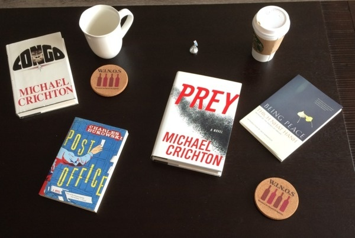
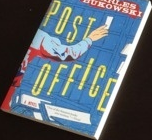
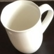

### Find Contours and Crop Objects 

Hey there! today i assembled this quick ready to use code which can help ease the problem of sorting objects from images this project is very exciting, you just fetch the program with an image containing lot of objects with different shapes and it will automatically find them, crop them and save them separately for you.

#### Required Module

````python
>> pip install opencv-contrib-python
````

#### How to Run

Just run the ``crop_objects.py`` and see the magic, It will pickup ``sample_image.jpg`` will find the objects such as book,cup, badges and save them separately after cropping in a ``cropped`` directory.

#### Illustrations

> Input Image ``sample_image.jpg``
>
> 


#### Cropped Objects

> 1.png
>
> 
>
> 2.png
>
> 
>
> 3.png
>
> 
>
> 4.png
>
> 
>
> 5.png
>
> 
>
> 6.png
>
> 
>
> 7.png
>
> 
>
> 8.png
>
> 